# MySQL-IDE
It is a Java desktop application which provide a GUI interface to the MySQL community server. User can access the whole MySQL community server without remembering any query. 

## Application Screenshots :-

### 1. User Registration :

New user register here to create username and password to access the applicatoion.

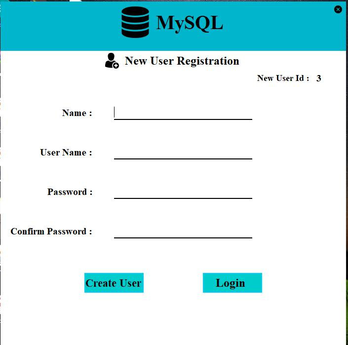

### 2. User Login :

Afetr registration user will login from login window to access the application. 

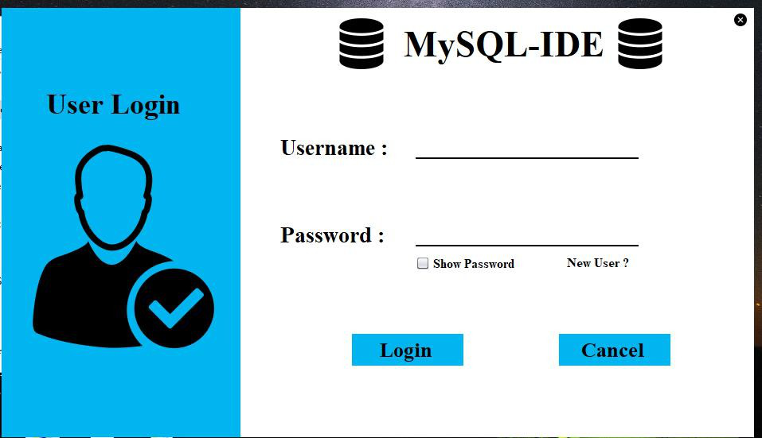

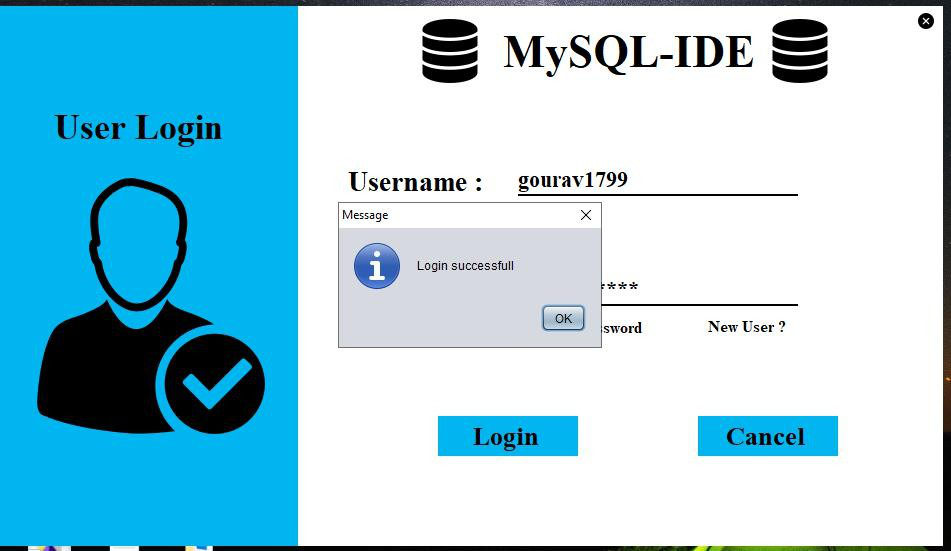

### 3. Home Screen :

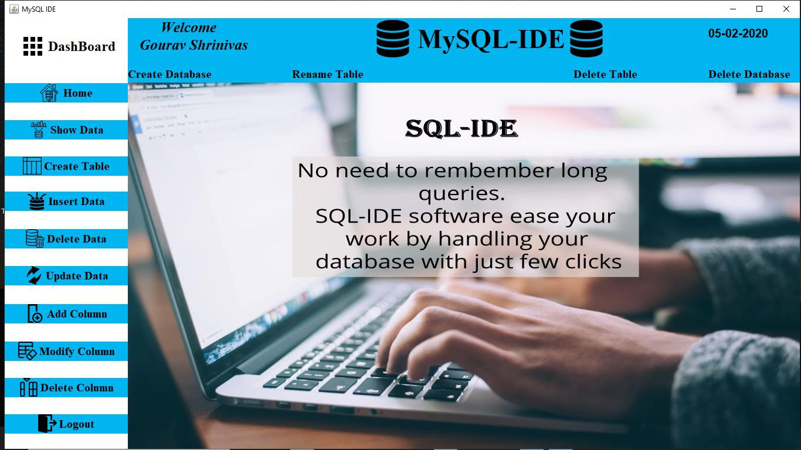

### 4. Show Data :

User can see here databse data in few clicks. The data will be show in the form of table.

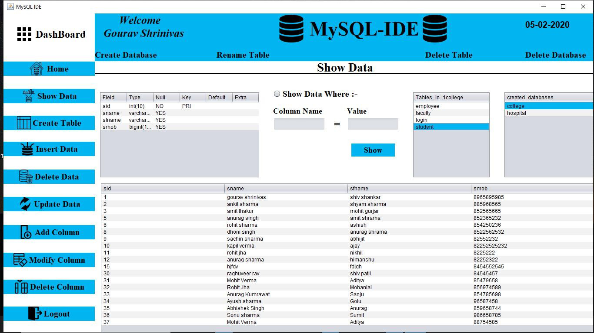

### 5. Create Table :

Using this window, user can creates database tables. 

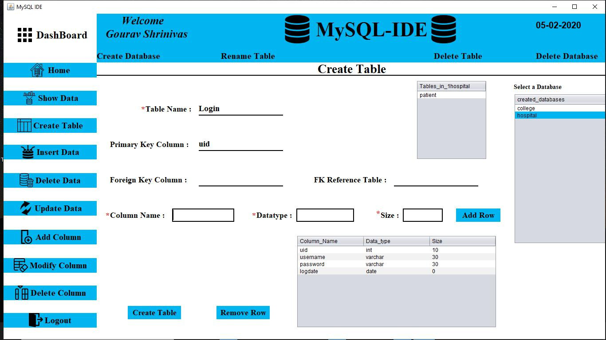

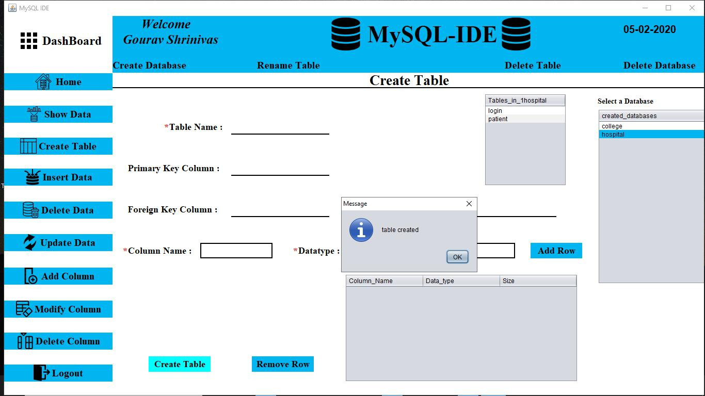

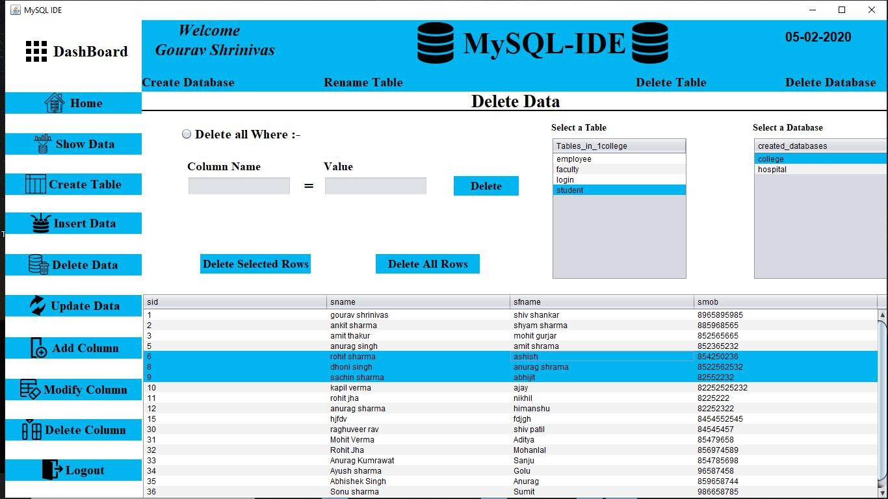

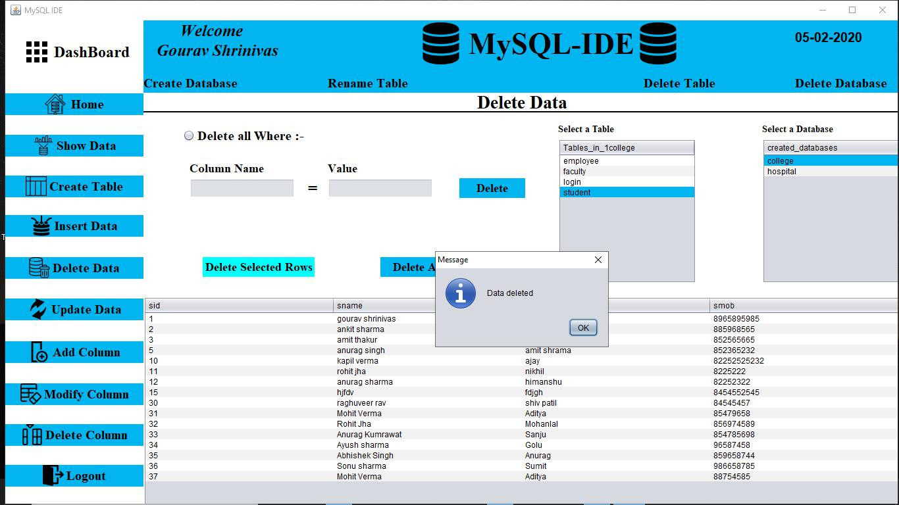

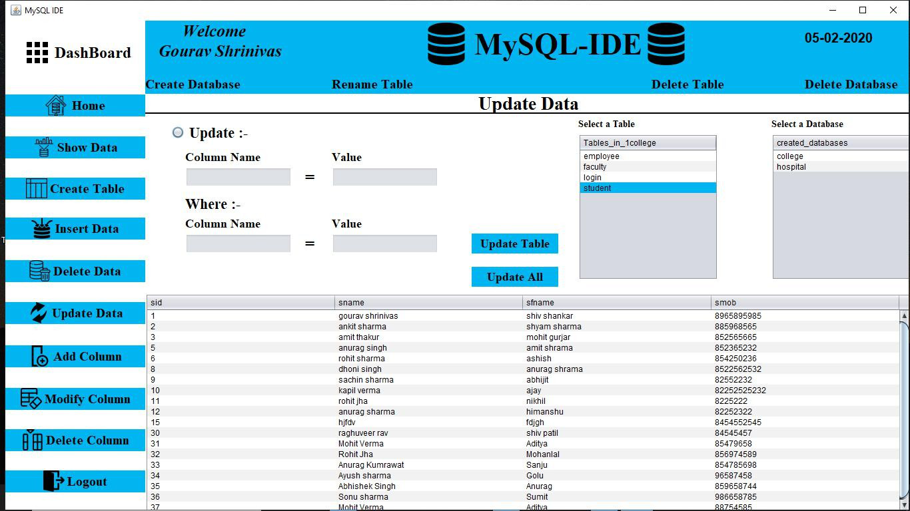

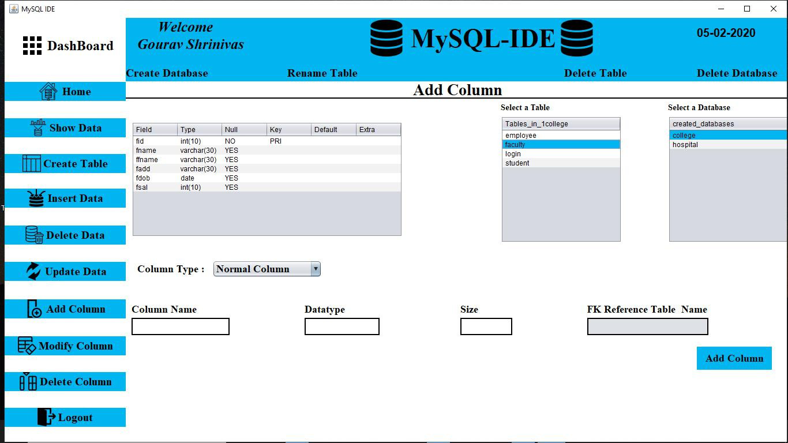

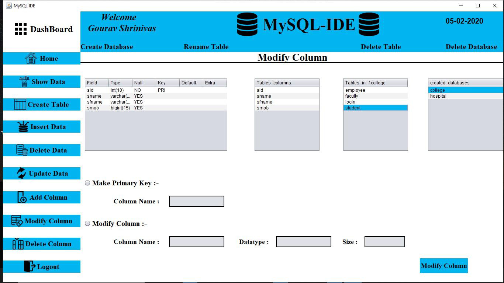

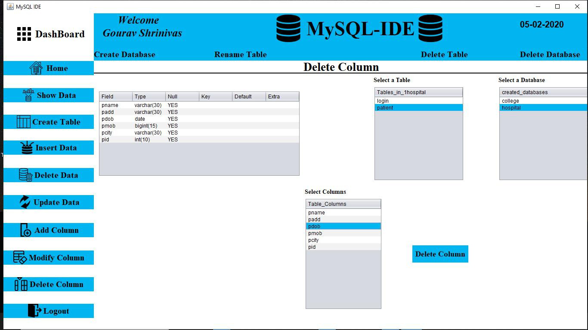

